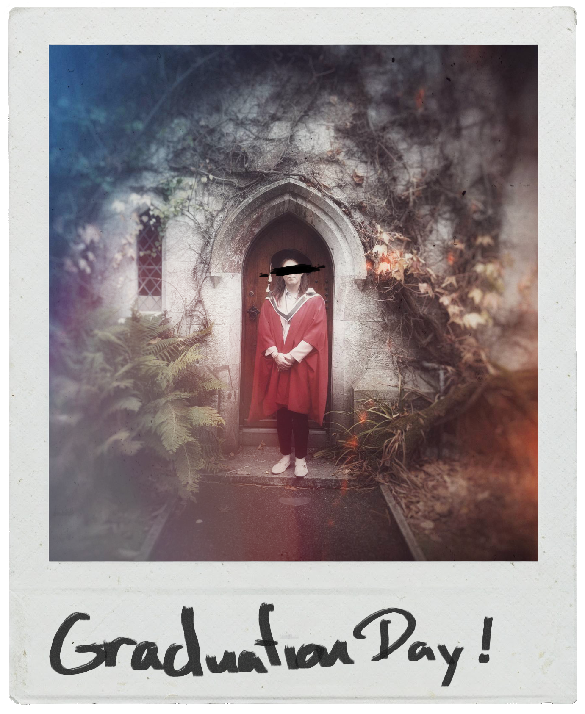

## Who is the Archivist?

    

        
That's a question I prefer to leave unanswered, for now. What matters is the work, the cases that DAPAUE would prefer to keep buried. My background... let's just say it's multifaceted. A bit of academia, a fascination with criminology, and an unhealthy obsession with technology and the paranormal have all played their part in shaping my current path. I've always had a knack for puzzles, for piecing together fragments of information to reveal the bigger picture. This skill has served me well, both in unravelling the complexities of criminal investigations and in navigating the labyrinthine world of anomalous phenomena.

    

    

        
    

---

    

        
That's a question I prefer to leave unanswered, for now. What matters is the work, the cases that DAPAUE would prefer to keep buried. My background... let's just say it's multifaceted. A bit of academia, a fascination with criminology, and an unhealthy obsession with technology and the paranormal have all played their part in shaping my current path. I've always had a knack for puzzles, for piecing together fragments of information to reveal the bigger picture. This skill has served me well, both in unravelling the complexities of criminal investigations and in navigating the labyrinthine world of anomalous phenomena.

    

    

        
    

    
    <a href="#" class="lightbox-close-css" aria-label="Close image dialog">×</a>

How I gained access to these [[DAPAUE]] files is a story shrouded in its own mystery. There are whispers, of course. Some believe it's a matter of familial ties, a relative who once walked the halls of DAPAUE and left behind a legacy of secrets. Others subscribe to a more dramatic narrative: an unsolved case, a personal quest for answers that led me down a winding path, ultimately revealing a hidden archive, a treasure trove of the unexplained.

The truth is likely more complicated, and perhaps less glamorous. But what's important is that I have these files, and I feel a responsibility to share them. To shed light on the shadows, to foster understanding, even when that understanding challenges our perception of reality. I operate discreetly, deliberately, allowing the focus to remain on the cases themselves, on the strange and compelling evidence that DAPAUE has collected. The world deserves to know what lurks beneath the surface of the ordinary.